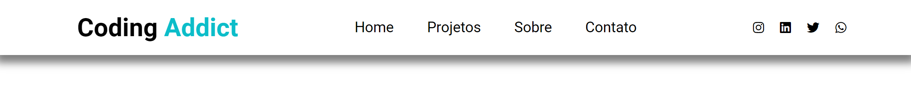
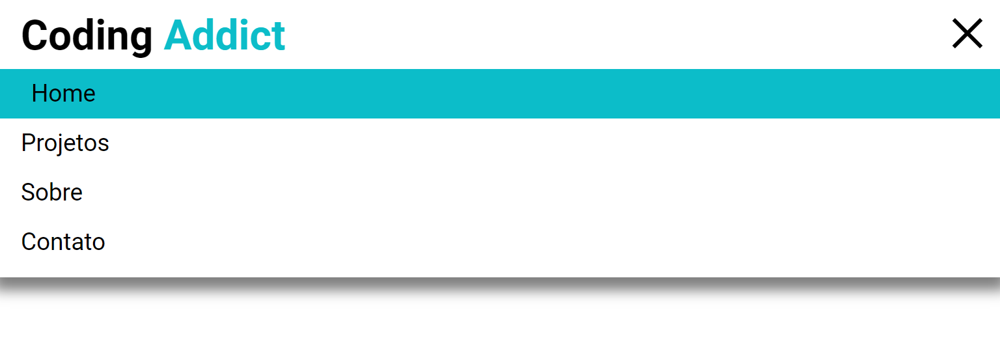

## 💻 Projeto

Uma navbar responsiva que mostrará o menu de hambúrguer para dispositivos menores.

## 🚀 Tecnologias

- [HTML](https://developer.mozilla.org/pt-BR/docs/Web/HTML)
- [SASS](SASS-lang.com)
- [JS](https://developer.mozilla.org/pt-BR/docs/Web/JavaScript)

## 📝 Conceitos usados nesse projeto:

- document.querySelector()
- addEventListener()
- classList.toggle()

[Link da pagina](https://clintonrocha98.github.io/Navbar/)

  
</img>

  
</img>

  
</img>

